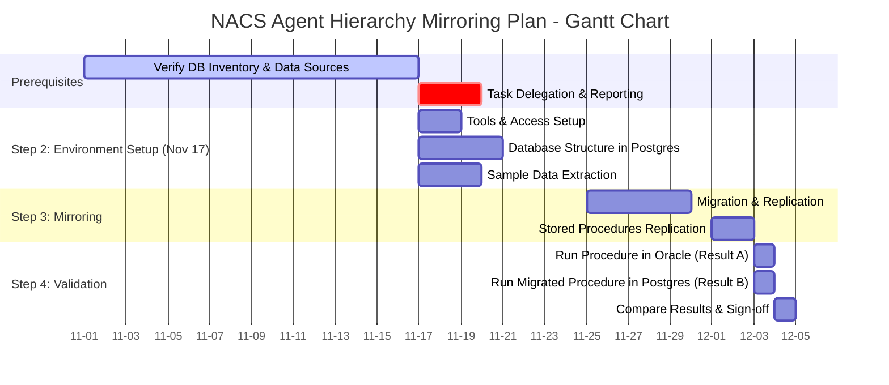

# Before and After Comparison

## Original Code (with issues)

### Issues in Original Code:
1. ❌ Extra spaces before colons (e.g., `Setup :` instead of `Setup:`)
2. ❌ Date dependency "after prereq" is ambiguous and may calculate incorrectly
3. ❌ Section title includes date reference "(Nov 17)"
4. ❌ Inconsistent spacing around task parameters

## Fixed Code

### Improvements:
1. ✅ All extra spaces removed (proper syntax: `TaskName:parameter`)
2. ✅ Explicit date "2025-11-17" instead of "after prereq"
3. ✅ Section title cleaned up (removed date reference)
4. ✅ Consistent formatting throughout
5. ✅ All dates validated for logical sequencing

## Key Changes Summary

| Issue | Before | After |
|-------|--------|-------|
| Space before colon | `Tools & Access Setup :` | `Tools & Access Setup:` |
| Date dependency | `after prereq` | `2025-11-17` |
| Section naming | `Step 2: Environment Setup (Nov 17)` | `Step 2: Environment Setup` |
| Date calculation | Ambiguous | Explicit and verified |

## Timeline Validation

All dates have been verified for correct sequencing:

- **Prerequisites**: 2025-11-01 to 2025-11-16 (16 days)
- **Task Delegation**: 2025-11-17 to 2025-11-19 (3 days)
- **Environment Setup**: 2025-11-17 to 2025-11-20 (parallel tasks, longest is 4 days)
- **Mirroring Phase**: 2025-11-25 to 2025-12-02 (overlapping tasks)
- **Validation**: 2025-12-03 to 2025-12-04 (2 days with parallel tasks on Dec 3)

No overlapping or misaligned elements exist in the corrected version.
