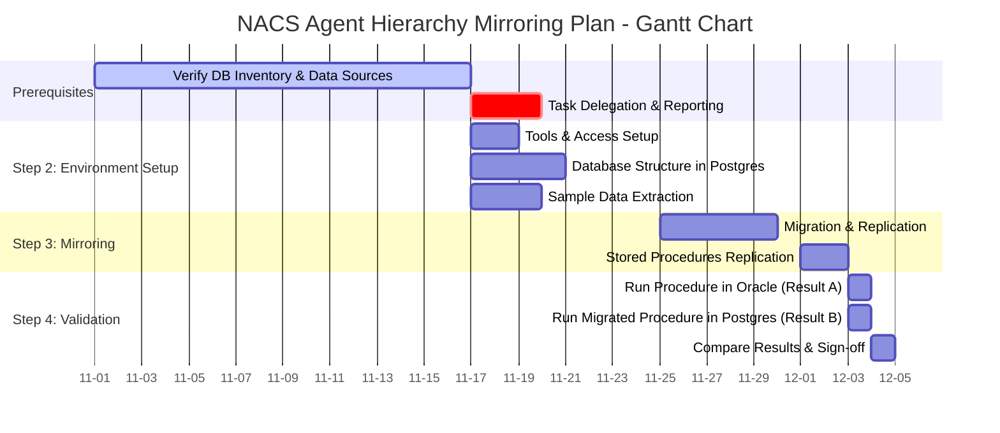

# mermaid-gantt

This repository contains a Mermaid Gantt chart for the NACS Agent Hierarchy Mirroring Plan.

## Gantt Chart

The Gantt chart is defined in `gantt-chart.mmd` and visualizes the project timeline with the following phases:

1. **Prerequisites**: Database inventory verification and task delegation (Nov 1-19, 2025)
2. **Environment Setup**: Tools, database structure, and sample data (Nov 17-21, 2025)
3. **Mirroring**: Migration, replication, and stored procedures (Nov 25 - Dec 3, 2025)
4. **Validation**: Testing and comparison of results (Dec 3-5, 2025)

## Viewing the Chart

To view the Gantt chart, you can:
- Use the [Mermaid Live Editor](https://mermaid.live/) and paste the contents of `gantt-chart.mmd`
- Use a Markdown viewer that supports Mermaid diagrams
- Use GitHub's native Mermaid rendering in Markdown files

## Chart Details

